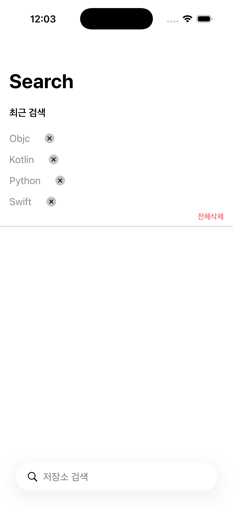
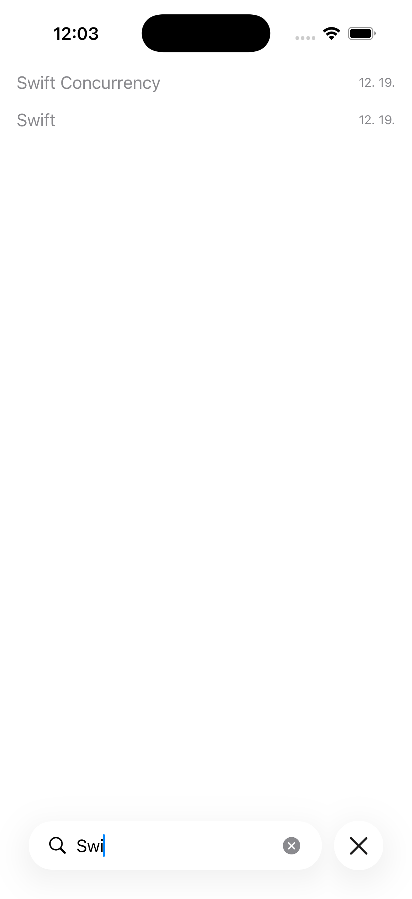
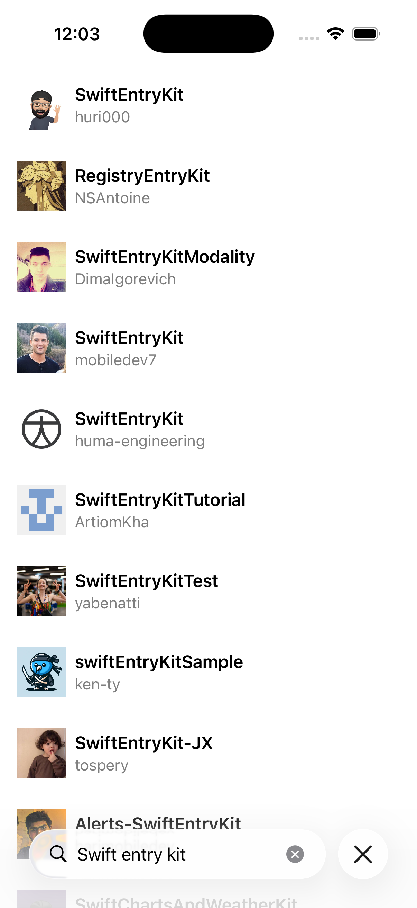

# GitHub Repository Search

GitHub 저장소를 검색하고 탐색할 수 있는 iOS 애플리케이션입니다.

## 📱 스크린샷

| 검색 화면 | 최근 검색어 | 검색 결과 | 상세 화면 |
|:---:|:---:|:---:|:---:|
|  |  |  |  |

## ✨ 주요 기능

### 검색 화면
- 검색어 입력을 통한 GitHub 저장소 검색
- 최근 검색어 최대 10개 목록 표시 (최신순 정렬)
- 최근 검색어 탭하여 재검색
- 최근 검색어 개별삭제 / 전체삭제
- (Optional) 최근 검색어를 바탕으로 자동완성 기능구현/검색 날짜 포함

### 검색 결과 화면
- 검색 결과 리스트 표시
- 총 검색 건수 표시
- 저장소 정보 표시
  - Thumbnail: 소유자 아바타 이미지
  - Title: 저장소 이름
  - Description: 소유자 로그인명
- 셀 선택 시 WebView로 저장소 상세 페이지 이동
- (Optional) 무한 스크롤 페이지네이션
- (Optional) 페이지 로딩 인디케이터

## 🛠 기술 스택

| 구분 | 사용 기술 |
|:---|:---|
| UI Framework | SwiftUI & UIKit |
| Architecture | Clean Architecture + MVVM |
| 최소 지원 버전 | iOS 15.0+ |

## 📁 프로젝트 구조

```
```

## 🔗 API

GitHub REST API를 사용합니다.

**Endpoint**
```
GET https://api.github.com/search/repositories
```

**Parameters**
| Parameter | Type | Description |
|:---|:---|:---|
| q | String | 검색 키워드 |
| page | Int | 페이지 번호 (기본값: 1) |


**Response**
```json
{
    "total_count": 372678,
    "incomplete_results": false,
    "items": [
        {
            "id": 44838949,
            "node_id": "MDEwOlJlcG9zaXRvcnk0NDgzODk0OQ==",
            "name": "swift",
            "full_name": "swiftlang/swift",
            "private": false,
            "owner": {
                "login": "swiftlang",
                "id": 42816656,
                "node_id": "MDEyOk9yZ2FuaXphdGlvbjQyODE2NjU2",
                "avatar_url": "https://avatars.githubusercontent.com/u/42816656?v=4",
                ...
            },
            ....
        },
        ...
    ]
}
```
